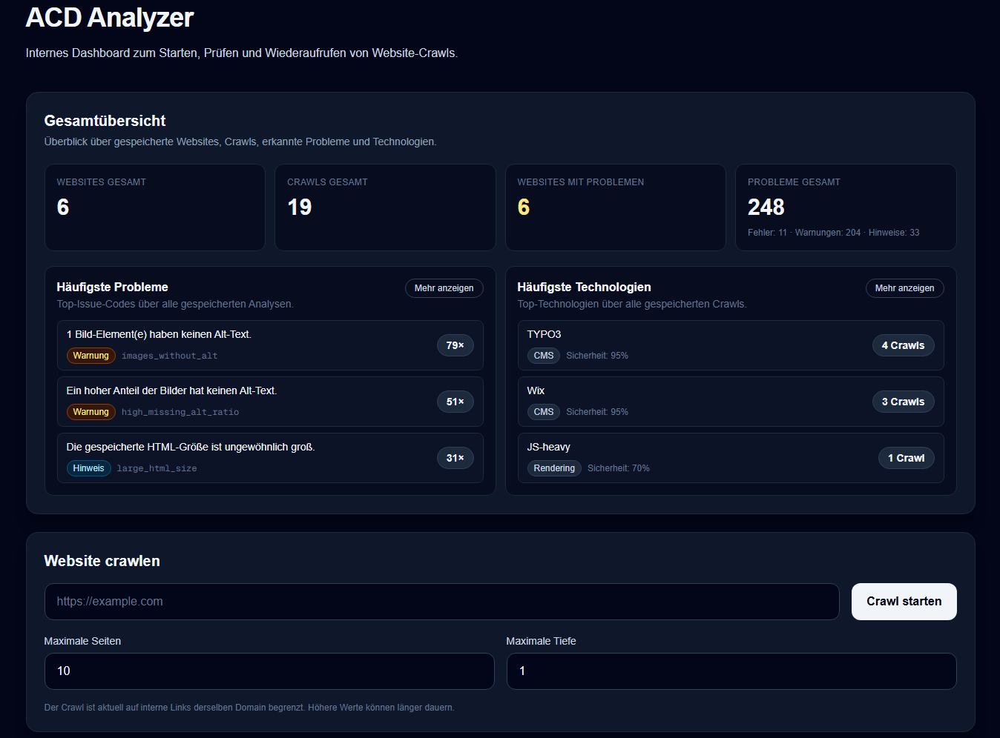
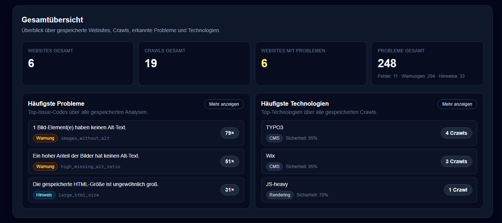
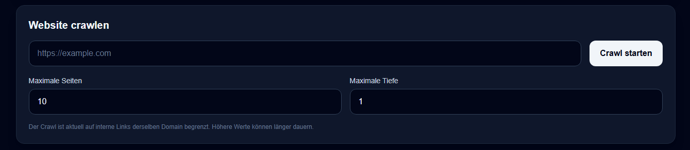
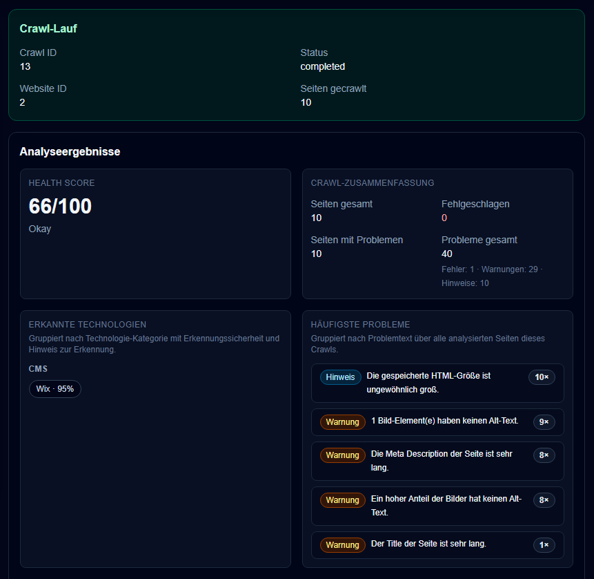
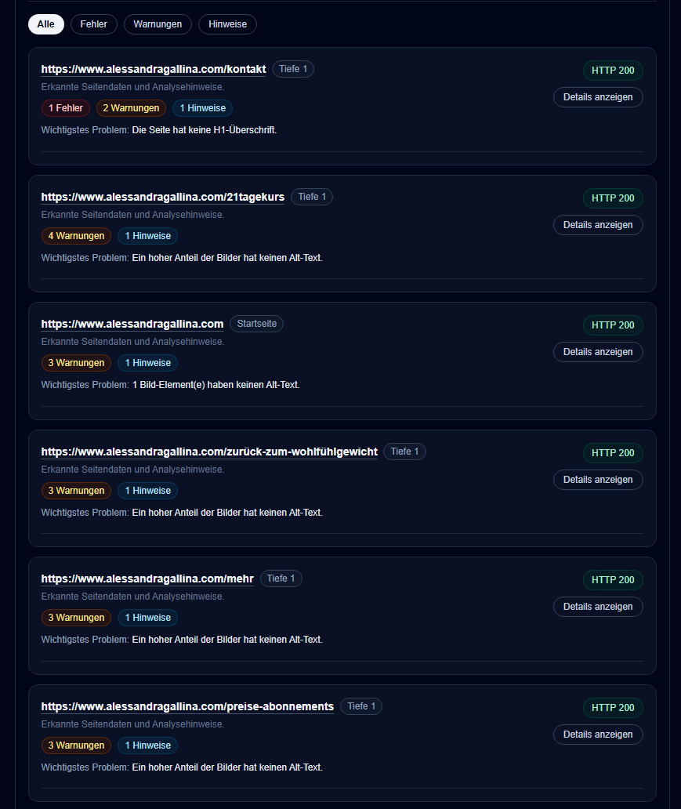

# ACD Analyzer

<p align="center">

A modern website crawling and technical website analysis platform built with **Laravel**, **Next.js**, **TypeScript**, **PostgreSQL** and **Docker**.

Designed as a modular foundation for technical website audits, SEO analysis and future quality checks.

</p>

---



---

## Features

- 🌐 Crawl websites via HTTP
- 📄 Multi-page website crawling
- 📊 Dashboard with crawl statistics
- ❤️ Health Score calculation
- 🔍 Technical SEO analysis
- 🏷️ Technology detection (CMS, Frontend, Rendering)
- ⚠️ Severity-based issue detection
- 📑 Crawl history
- 📈 Aggregated issue statistics
- 🐳 Docker-first development environment

---

# Screenshots

## Dashboard

Overview of all crawled websites, detected technologies and the most common issues.



---

## Start a Crawl

Configure the crawl and start analyzing a website.



---

## Crawl Results

Detailed analysis including Health Score, technologies and aggregated findings.



---

## Page Analysis

Every crawled page is analyzed individually.

Detected issues are grouped by severity and displayed together with HTTP status, crawl depth and additional metadata.



---

# Features in Detail

## Website Crawling

- configurable crawl depth
- configurable page limit
- HTTP status tracking
- crawl history
- crawl persistence

## Technical SEO

The analyzer currently detects issues such as

- Missing page title
- Short page title
- Long page title
- Missing meta description
- Short meta description
- Long meta description
- Missing H1
- Multiple H1 headings
- Missing H2 structure
- Duplicate headings
- Missing HTML language
- Missing viewport meta tag
- Missing canonical tag
- Robots noindex
- Images without alt text
- High ratio of missing alt texts
- Empty link text
- Few internal links
- Slow response times
- HTTP error pages
- Large HTML documents

---

## Health Score

Each crawl receives an overall Health Score.

The score summarizes all detected issues while taking their severity into account.

Example:

- Error
- Warning
- Information

The goal is not to replace manual reviews but to provide a quick technical overview of website quality.

---

## Technology Detection

The analyzer detects common technologies including:

- TYPO3
- WordPress
- Wix
- React
- Vue
- Angular
- Next.js
- Bootstrap

and identifies likely JavaScript-heavy websites.

---

# Architecture

```
                    +----------------------+
                    |     Next.js UI       |
                    +----------+-----------+
                               |
                               | REST API
                               |
                    +----------v-----------+
                    |     Laravel API      |
                    +----------+-----------+
                               |
          +--------------------+--------------------+
          |                                         |
          |                                         |
+---------v---------+                 +-------------v------------+
|   Website Crawler |                 | Crawl Analysis Service   |
+---------+---------+                 +-------------+------------+
          |                                         |
          +--------------------+--------------------+
                               |
                     +---------v---------+
                     |   PostgreSQL DB   |
                     +-------------------+
```

---

# Tech Stack

| Backend | Frontend | Database | DevOps |
|---------|----------|-----------|--------|
| Laravel 12 | Next.js | PostgreSQL | Docker Compose |
| PHP 8.3 | React | | Nginx |
| PHPUnit | TypeScript | | |

---

# Project Structure

```
backend/
frontend/
docker/
docs/
```

---

# Getting Started

## Requirements

- Docker
- Docker Compose

---

Clone the repository

```bash
git clone https://github.com/<username>/acd-analyzer.git

cd acd-analyzer
```

Start the environment

```bash
docker compose up -d
```

Backend

```bash
docker compose exec app composer install
docker compose exec app php artisan migrate
```

Frontend

```bash
docker compose exec frontend npm install
```

Open

```
Frontend:
http://localhost:3000

Backend API:
http://localhost:8000
```

---

# Development Philosophy

The project follows a modular architecture.

Key principles include:

- Docker-first development
- Small focused services
- Typed frontend API
- Persistent crawl analysis
- Testable backend services
- Separation of crawling and analysis
- Incremental feature development

---

# Roadmap

## Completed

- HTTP crawler
- Crawl persistence
- Dashboard
- Health Score
- Technology Detection
- Technical SEO Analyzer
- Crawl History
- Severity-based issue system
- Multi-page crawling
- Aggregated statistics

---

## Planned

- Lighthouse integration
- JavaScript rendering (Playwright)
- Sitemap support
- PDF reports
- Authentication
- User management
- Scheduled crawls
- Export functions
- Custom analyzer rules
- Plugin system

---

# Motivation

Most website audit tools are either closed-source or difficult to extend.

The goal of ACD Analyzer is to build a modular and extensible platform that can evolve from an internal developer tool into a comprehensive website quality analysis platform.

The project serves both as a practical development platform and as an opportunity to explore scalable software architecture using Laravel, Next.js and Docker.

---

# License

This project is licensed under the MIT License.